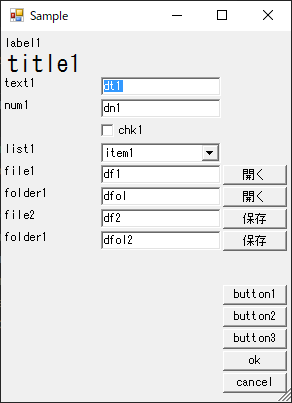
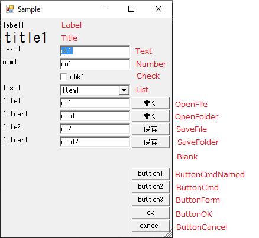
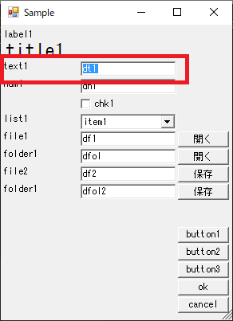
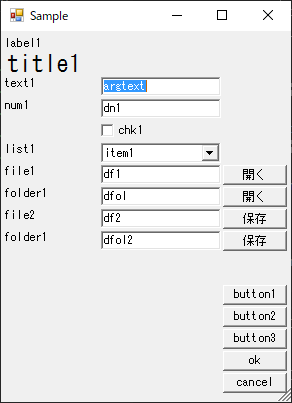
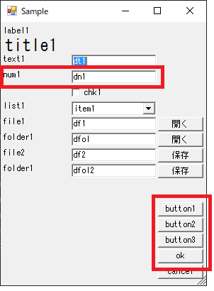
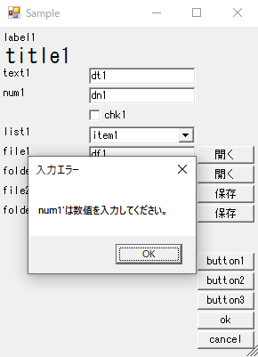
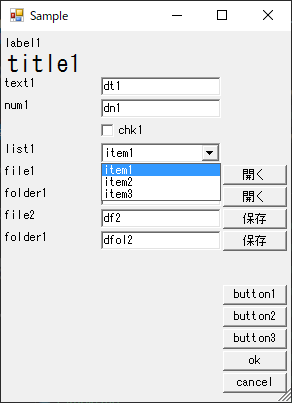
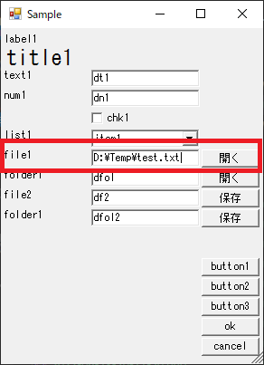
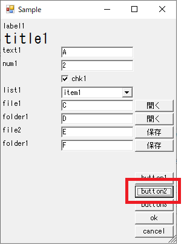

# サンプル
## フォームの表示方法
同梱の"sample\\sample.cmd"を実行してください。

## フォームの見た目
### フォーム
第一階層の記述はフォームに関するものなっています。コンポーネントの記述は"Components"に配列として記述します。

```
{
    "Version": "0.3",
    "Title": "さんぷる",
    "TitleBar": "Sample",
    "Width": 0,
    "Height": 0,
    "StartY": 4,
    "PaddingX": 2,
    "PaddingY": 2,
    "Components": [
        (略)
    ]
}
```

上記のように設定した場合、フォームは以下のような見た目で表示されます。



## コンポーネントについて
コンポーネントは、上から順番に記述します。多くの設定値はあってもなくてもいい任意項目ですが、"Type"は必ず設定する必要があります。サンプルでは以下のTypeでコンポーネントが配置されています。




### 基本情報
テキスト入力ボックスtext1に以下のような設定をした場合を例に、基本情報について説明します。
```
    ...
        {
            "Id": "text1",
            "Type": "Text",
            "Label": "text1",
            "Default": "dt1",
            "Required": true,
            "Return": true
        },
    ...
```



#### ID
IDはこのテキストボックスに何が入力されたかを次の動作に伝えるために使用します。具体的には、このテキストボックスをOKボタンで処理した際には`@{"tex1": "dt1"}`のように入力値をキーにしたオブジェクトが戻り値になったりします。

#### Label
そのコンポーネントの表示名です。

#### Default
そのコンポーネントの入力欄に設定される初期値です。

初期値は、KantanGUI-Showコマンドの第二引数"-ArgumentList"から上書きすることも可能です。

```
KantanGUI-Show sample.json @{"text1":"argtext"}
```



### バリデーションチェック
数値入力ボックスnum1に以下のような設定をした場合を例に、バリデーションについて説明します。

```
    ...
        {
            "Id": "num1",
            "Type": "Number",
            "Label": "num1",
            "Default": "dn1",
            "Required": true,
            "Return": true
        },
    ...
```

num1は数値限定のテキストボックス(`"Type": "Number"`)で、必須項目(`"Required": true`)に指定されているため、それらの条件を満たさずに実行ボタンを押すとバリエーションエラーが表示されます。



バリデーションエラーは上から順にチェックされ、エラーがあった場合は最初のコンポーネントにフォーカスされます。



### リストボックス
リストボックスlist1に以下のような設定をした場合を例に、リストボックスについて説明します。

```
    ...
        {
            "Id": "list1",
            "Type": "List",
            "Label": "list1",
            "Default": "item1",
            "Items": [
                "item1",
                "item2",
                "item3"
            ],
            "Return": true
        },
    ...
```

#### Items
Itemsには文字列配列を指定してください。指定した内容がそのままリストボックスのプルダウンに列挙されます。また、Itemsに含まれるものを初期値に指定することを推奨します。



### ドラッグアンドドロップ
ファイルを開くfile1に以下のような設定をした場合を例に、ドラッグアンドドロップについて説明します。

```
    ...
        {
            "Id": "file1",
            "Type": "OpenFile",
            "Label": "file1",
            "Default": "df1",
            "DandD": true,
            "Return": true
        },
    ...
```

file1はドラッグアンドドロップ(`"DandD": true`)に指定されているため、ファイルをドラッグアンドドロップすると、そのファイルのパスがfile1に入力されます。



また、この機能はOpenFolderにおいても共通です。ファイルをドロップしたかフォルダをドロップしたかによって入力されるコンポーネントが分かれます。

ドラッグアンドドロップフラグを持つコンポーネントはファイルとフォルダで各一つにとどめることを推奨します。

### 実行ボタン
コマンド実行ボタンbutton2に以下のような設定をした場合を例に、実行ボタンについて説明します。

```
    ...
        {
            "Id": "button2",
            "Type": "ButtonCmd",
            "Label": "button2",
            "Validation": true,
            "Close":"Always",
            "Target": "sample\\src\\event.cmd"
        },
    ...
```

#### Validation
button2はバリデーションチェック(`"Validation": true`)に指定されているため、ボタンを押したときには各入力コンポーネントに対してバリデーションチェックを実行します。

#### Close
button2は実行時終了(`"Close":"Always"`)に指定されているため、ボタンを押したときには各入力コンポーネントに対してバリデーションチェックを実行します。

#### Target
button2の"Target"に"sample\\src\\event.cmd"が設定されているため、ボタン押下時にコマンドファイルが実行されます。



各コンポーネントのうち、出力オプション(`"Return": true`)が指定されているものを引数にコマンドが実行されます。

```
...\\sample\\src\\event.cmd "A" 2 True "item1" "C" "D" "E" F
```
